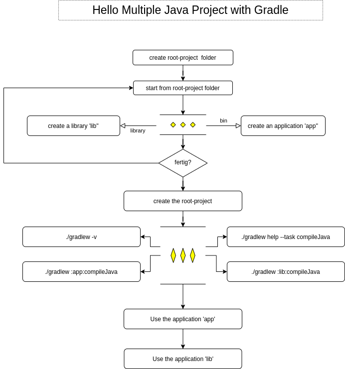

# 1. About Multi-Project Builds in Gradle

## structure for projects

```bash
.
├── app
│ ├── build.gradle
│ └── src
│     ├── main
│     │ └── java
│     │     └── hello_app
│     │         └── App.java
│     └── test
│         └── java
│             └── hello_app
│                 └── AppTest.java
├── .gitattributes
├── .gitignore
├── gradle
│ └── wrapper
│     ├── gradle-wrapper.jar
│     └── gradle-wrapper.properties
├── gradlew
├── gradlew.bat
├── lib
│ ├── build.gradle
│ └── src
│     ├── main
│     │ └── java
│     │     └── hello_lib
│     │         └── Library.java
│     └── test
│         └── java
│             └── hello_lib
│                 └── LibraryTest.java
├── LICENSE
├── README.md
└── settings.gradle
```

## Use the projects

```bash
git clone https://github.com/cnruby/hello_gradle_java.git
./gradlew -q run

>> Library = true
>> Hello world.
```

# 2. Create the Multi-Project Builds in Gradle



## create an application 'app'

```bash
mkdir app && cd app
gradle init --project-name hello_app --type java-application
ENTER
4 ENTER
ENTER

mv .gitattributes .gitignore gradlew* gradlew.bat settings.gradle ..
mv -t .. .gradle gradle
```

## create a library 'lib'

```bash
mkdir app && cd app
gradle init --project-name hello_lib --type java-library
ENTER
4 ENTER
ENTER

rm .gitattributes .gitignore gradlew* gradlew.bat settings.gradle
rm -rf .gradle/ gradle/
```

## create the root-project

```bash
vi settings.gradle

# settings.gradle
rootProject.name = 'root_app'
include 'app'
include 'lib'
'

## Gradle version

```bash
./gradlew -v
```


## Task: 'compileJava'

```bash
./gradlew help --task compileJava

./gradlew :app:compileJava
./gradlew :lib:compileJava
```

## Use the application "app"

```bash
./gradlew help --task run

./gradlew :app:run
```


## Use the library "lib"

### Step 1:
```bash
vi app/build.gradle

# app/build.gradle
...
dependencies {
    implementation project(':lib')
...
```

### Step 2:
```bash
vi app/src/main/java/hello_app/App.java

# app/src/main/java/hello_app/App.java
...
import hello_lib.Library;

public class App {
    public String getGreeting() {
        Library library = new Library();
        System.out.println("Library = " + library.someLibraryMethod());
...
```

### Step 3:
```bash
./gradlew run
./gradlew :app:run
./gradlew -q :app:run
```

## References 
- https://docs.gradle.org/6.7/userguide/multi_project_builds.html